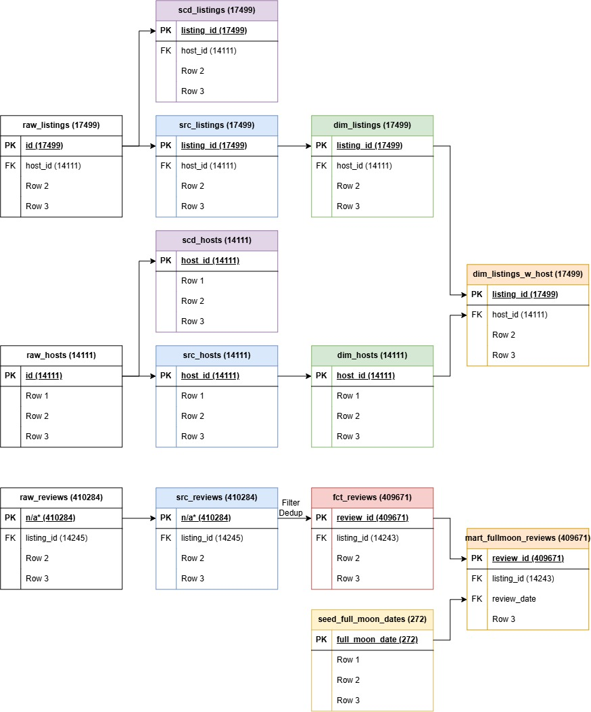

# dbt-bootcamp-project
This is a project from the dbt bootcamp course.  
This project pulls three data sources to create two tables ready for analysis, one fact table for review and one dimension table with listing details. 
Below is the datat model diagram.  
 

